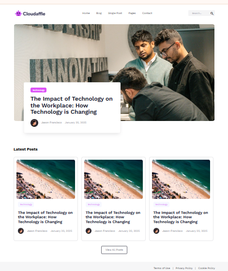

# Cloudaffle

**[Live Demo](https://your-live-link-here.com)**

## Project Screenshot



## About This Project

This project was developed as part of the **[Complete Full Stack Web Development Bootcamp](https://www.udemy.com/course/complete-full-stack-web-development-bootcamp/)** on Udemy. It showcases responsive web design principles and modern front-end development practices.

## What I Learned

Through building this project, I gained hands-on experience with:

- **HTML & CSS Fundamentals** - Semantic HTML structure and CSS styling
- **Responsive Design** - Creating mobile-first layouts that work across all devices
- **CSS Variables** - Managing design tokens and color schemes efficiently
- **CSS Reset & Normalization** - Ensuring consistent styling across browsers
- **Professional Workflow** - Organizing stylesheets and maintaining clean code

## Project Structure

```
├── index.html          # Main HTML file
├── styles/
│   ├── css-reset.css   # Browser reset styles
│   ├── variables.css   # CSS custom properties
│   ├── style.css       # Main stylesheet
│   └── mobile.css      # Mobile responsive styles
├── images/             # Project assets
└── figma/              # Design files
```

## License

This project is licensed under the MIT License - see the [LICENSE](./LICENSE) file for details.
